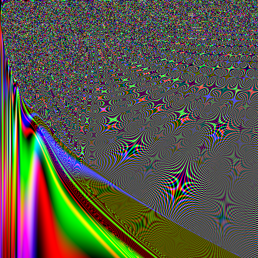

<!-- PROJECT LOGO -->
<br />
<p align="center">
  <a href="https://github.com/cdwr/Art-Generator">
    
  </a>

  <h3 align="center">Modern Art Generator</h3>

  <p align="center">
    This is a simple python script that generates modern art using Pillow (PIL) Currently, it only generates stills, but will soon generate a stream with constantly shifting images.
    <br />
  </p>
</p>


<!-- TABLE OF CONTENTS -->
<details open="open">
  <summary><h2 style="display: inline-block">Table of Contents</h2></summary>
  <ol>
    <li>
      <a href="#about-the-project">About The Project</a>
      <ul>
        <li><a href="#built-with">Built With</a></li>
      </ul>
    </li>
    <li>
      <a href="#getting-started">Getting Started</a>
      <ul>
        <li><a href="#installation">Installation</a></li>
      </ul>
    </li>
    <li><a href="#contact">Contact</a></li>
  </ol>
</details>

### Built With

* [Pillow](https://pillow.readthedocs.io/en/stable/)
* [Numpy](https://numpy.org/)


<!-- GETTING STARTED -->
## Getting Started

Simply clone the repository, and run Art_Origin.py with python 3.5+


### Installation

1. Clone the repo
   ```sh
   git clone https://github.com/cdwr/Art-Generator.git
   ```
2. Install Pillow
    ```sh
    pip install PIL
    ```
3. Run
    ```sh
    python3 Art_Origin.py
    ```
